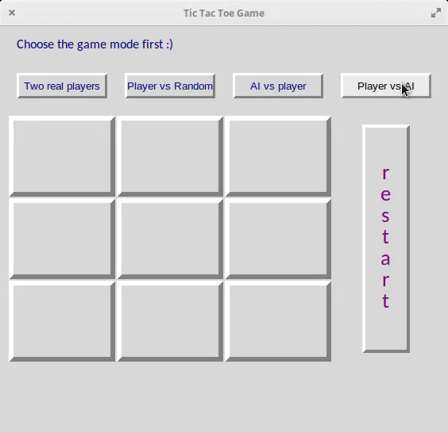

# Tic-tac-toe game

This program replicates the behaviour of the [Tic-tac-toe game](https://en.wikipedia.org/wiki/Tic-tac-toe).

`Tkinter` is used for the graphical representation of the game.

There are 4 modes available in the game:

- Two players: the user plays both players
- One player: the user plays one player, the other player is based on a random principle
- One player: the user plays **first**, the other player is based on the Minimax algorithm
- One player: the user plays **second**, the other player is based on the Minimax algorithm

#### Minmax algorithm

The Minimax algorithm used in two of the modes is based on [this pseudocode](https://en.wikipedia.org/wiki/Minimax#Pseudocode).

<br>
<div id="header" align="center">
  
</div>
<br>

### How to run

```
python main.py
```
