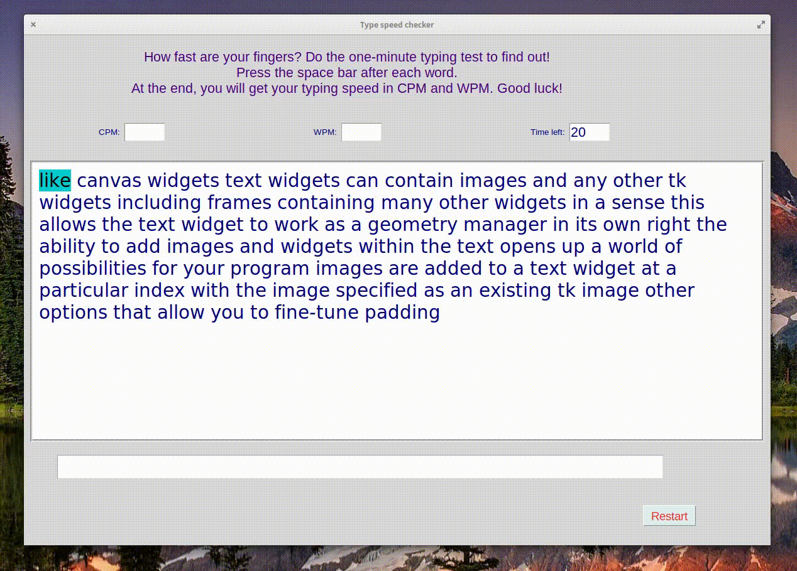

# Type text project

This program measures characters per minute, words per minute and mistakes made while typing.

The best score is saved in a file.

The most difficult part of the work was detecting and selecting each word in the text while the user is typing and also going back and fixing the typos made.

 

  

