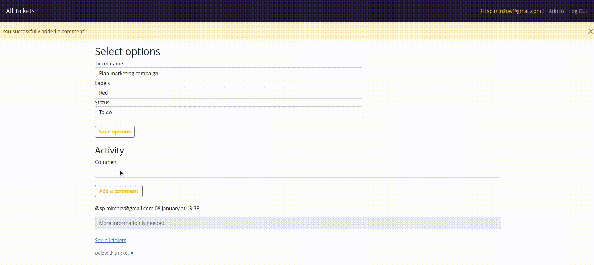

# To Do app

This is a simple To Do app that mimics some of the Trello functionality. It uses SQLite database.

In order to use the app, the user would have to register then login. This would allow them to then create/edit/comment on/delete tickets.

The user can also add labels to tickets and move tickets from one status to another.

The application uses Flask, SQLAlchemy, Flask-Login, Flask-Bootstrap and Werkzeug for password hashing.

Good things to improve would be

- the UI in general
- allow tickets to be dragged across statuses
- delete comments

<div id="header" align="center">
  
</div>

## Installation

```terminal
# Create an environment variable
python -m venv .env

python -m venv .env

source .env/bin/activate

# Run the app

python app.py
```
